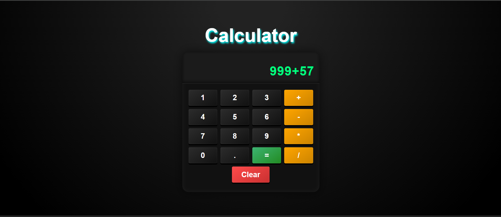
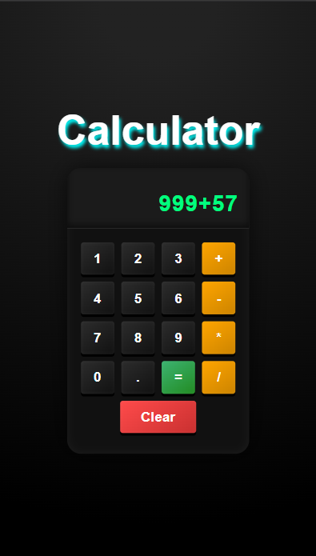

<h1 align="center">🧮 Simple Calculator</h1>

<p align="center">
  <b>A clean, realistic, and responsive Calculator built using pure HTML, CSS, and JavaScript.</b><br/>
  Perform basic arithmetic operations with a smooth and user-friendly interface 💻
</p>

---

## 🌐 Live Demo  
👉 **[View Live Project](https://roshan0011830.github.io/simple-calculator/)**  

---

## 📸 Screenshots  

### 💻 Desktop View  


### 📱 Mobile View  


---

## ✨ Features  

✅ **Basic Operations:** Addition, Subtraction, Multiplication, Division  
✅ **Clear Button:** Instantly resets the current input  
✅ **Real Calculator Feel:** Button layout and color scheme similar to real devices  
✅ **Responsive Design:** Works perfectly on mobile, tablet, and desktop  
✅ **Clean UI:** Minimalistic look with subtle shadows and color contrast  

---

## 🧩 Tech Stack  

| 💻 Technology | 🔧 Purpose |
|----------------|------------|
| **HTML5** | Calculator structure |
| **CSS3** | Styling & layout |
| **JavaScript (ES6)** | Logic for buttons & display updates |

---

## ⚙️ Working Flow  

🧠 Here's how the calculator works:  

1. All buttons (numbers, operators, clear, equal) are selected dynamically.  
2. When a user clicks a button:  
   - Its value is added to the expression string.  
   - Display updates in real time.  
3. When `=` is pressed, `eval()` executes the math operation.  
4. Pressing `C` clears everything.  

💡 *Note:* `eval()` is used for simplicity in this mini project.  
For production-level apps, a safer math parsing method is recommended.

---

## 🎨 UI Design Overview  

🎨 **Theme:** Realistic dark tone with soft shadows  
📱 **Responsive:** Fully adapts to small & large screens  
🔢 **Layout:** 4x5 grid (digits & operators neatly aligned)  
🖱️ **Button Feel:** Inset shadows for 3D calculator look  

---

## 📲 Responsive Design Review  

This calculator adjusts beautifully on every screen:  

| Device | Layout Description |
|---------|--------------------|
| 💻 **Desktop** | Full layout with clear display & spacing |
| 📱 **Mobile** | Compact buttons & centered structure |
| 🧭 **Tablet** | Balanced grid design with easy tap controls |

---

## 🚀 How to Run Locally  

Follow these simple steps 👇  

1. **Clone the repository**  
   ```bash
   git clone https://github.com/roshan0011830/simple-calculator.git

---

## 👨‍💻 Author & Connect With Me  

**👨‍💻 Roshan Kumar**  
💼 Frontend Developer | HTML | CSS | JavaScript | React  

**📬 Let’s Connect:**  
- 🌐 **GitHub:** [roshan0011830](https://github.com/roshan0011830)  
- 💼 **LinkedIn:** [Roshan Pal](https://www.linkedin.com/in/roshan-pal-19391628b/)  

---

## ⭐ Show Your Support  

If you liked this project —  
🌟 **Star this repository** and share it with others!  
Your support motivates me to build and share more open-source projects 🚀  

---

## 🏷️ Tags  

`#HTML` `#CSS` `#JavaScript` `#Calculator` `#MiniProject` `#Frontend` `#DOMManipulation` `#WebDevelopment` `#ResponsiveDesign` `#PortfolioProject`

---

> 🧮 *"Simple Calculator — Clean UI, Clear Logic, Real Functionality."*


